  

### 🧰 What I'm into

- 🏠 **Home automation**: running Home Assistant on a Raspberry Pi and connecting everything I can to it
- 🐳 **Self-hosting**: a Docker stack on my own hardware, so I control the services I use
- 🌐 **Networking**: building out my home network one cable at a time
- 🤖 **APIs + AI**: connecting tools so they do the boring parts for me
- 🛠️ **Self-taught**: I learn by building, breaking, and fixing

### ⚙️ Toolbox

  
  
  
  
  
  
  
  

### 📫 Find me

Currently building, breaking, and figuring things out.
